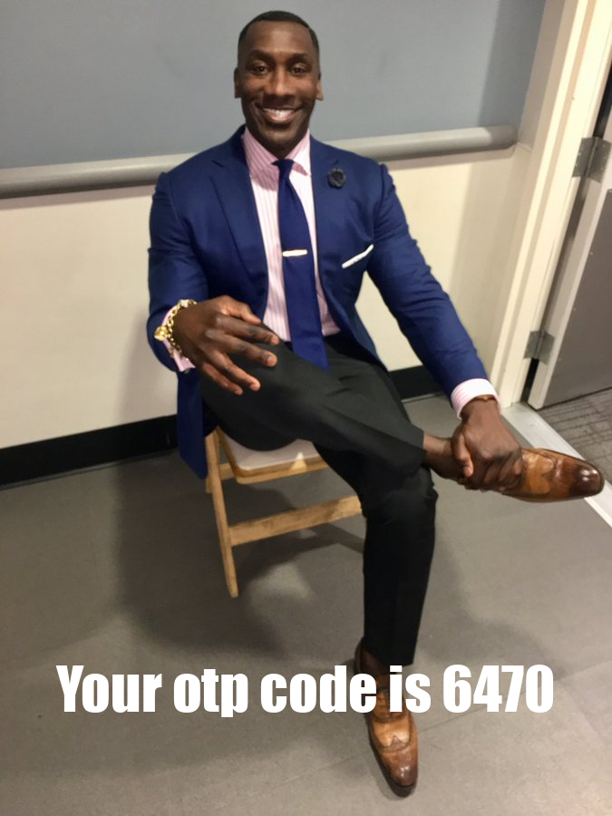

# OTP with meme image

Leisure project. A REST API that sends a one-time authentication code (a.k.a OTP) but the code is in the text of a meme image.

## Summary

If it works perfectly the result will be like this:

## Why this meme?

The meme used in this project is Shannon Smiling or better known as *The Guy Smiling And Wearing A Suit*, which is often paired with a negative text or _"My Reaction For That Information"_.

the reason why I chose this meme was inspired by a meme where a man screenshot the OTP sender's chat and he replied by sending a photo of himself posing cool. suddenly it gave me the idea to make an OTP system by sending pictures of people posing cool with the OTP code text.

Idk why I chose the photo of Shannon smiling, it's because I think with the meme photo of Shannon in addition to making a sense of humor but also as a sign of welcome and strengthens security.